

  <a href="https://portfolio-ayushpandey.vercel.app">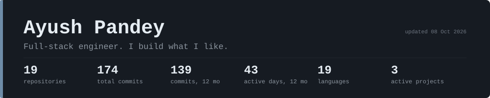</a>

  
  
  
  

Backends in **Rust** and **Python**, frontends in **React**, mobile apps in **Flutter**. I pick the stack each problem needs and build it end to end.

## Featured
Pinned projects, most recently worked on first. Click a card to open the repo.

<!-- AUTO:FEATURED:START -->

  <a href="https://github.com/AyushPandey510/SwiftShare">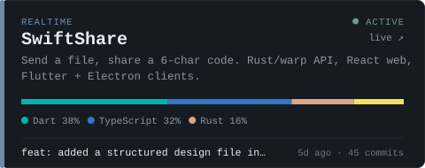</a>
  <a href="https://github.com/AyushPandey510/anonymous">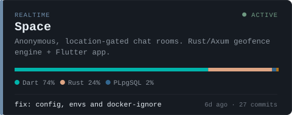</a>
  <a href="https://github.com/AyushPandey510/expense_calc">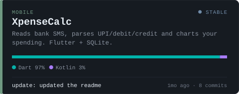</a>
  <a href="https://github.com/AyushPandey510/LifeEngine">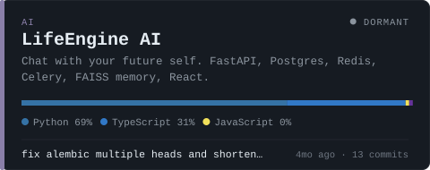</a>
  <a href="https://github.com/AyushPandey510/PDF-QA-RAG-OLLAMA-llama3">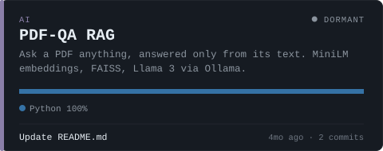</a>

<!-- AUTO:FEATURED:END -->

## What I build

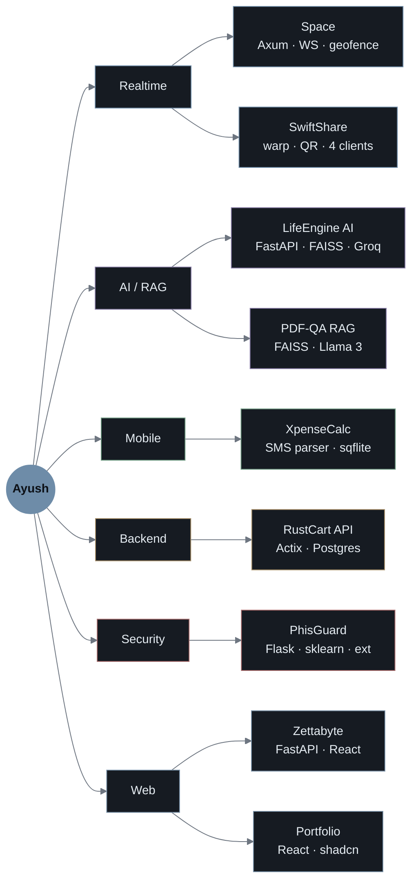

  <a href="https://github.com/AyushPandey510/anonymous"><kbd>Space</kbd></a>
  <a href="https://github.com/AyushPandey510/SwiftShare"><kbd>SwiftShare</kbd></a>
  <a href="https://github.com/AyushPandey510/LifeEngine"><kbd>LifeEngine AI</kbd></a>
  <a href="https://github.com/AyushPandey510/PDF-QA-RAG-OLLAMA-llama3"><kbd>PDF-QA RAG</kbd></a>
  <a href="https://github.com/AyushPandey510/expense_calc"><kbd>XpenseCalc</kbd></a>
  <a href="https://github.com/AyushPandey510/Rust-Ecom-Api"><kbd>RustCart</kbd></a>
  <a href="https://github.com/AyushPandey510/Phis_Shield"><kbd>PhisGuard</kbd></a>
  <a href="https://github.com/AyushPandey510/Zettabyte"><kbd>Zettabyte</kbd></a>

## How they work
Architecture of the main projects. Expand one.

<b>Space</b>: anonymous chat that only opens when you're physically inside the zone

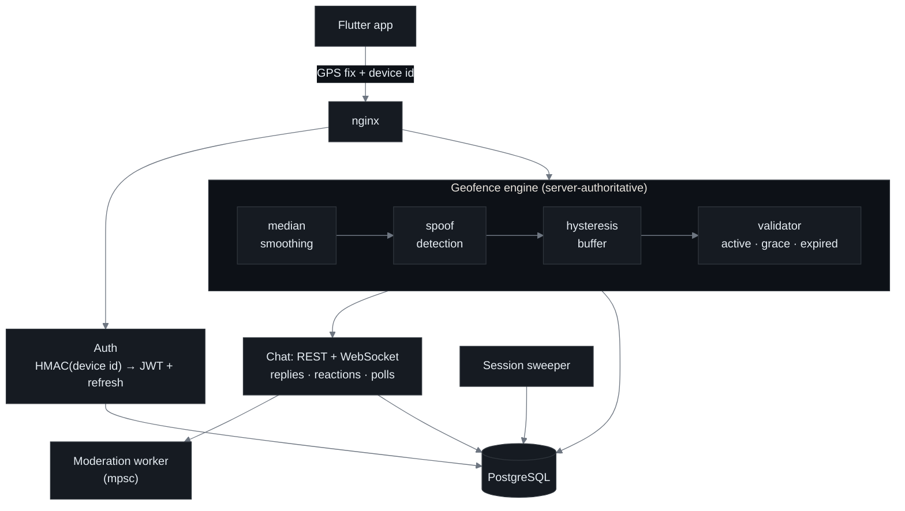

[→ open repo](https://github.com/AyushPandey510/anonymous)

<b>SwiftShare</b>: send a file, share a 6-char code

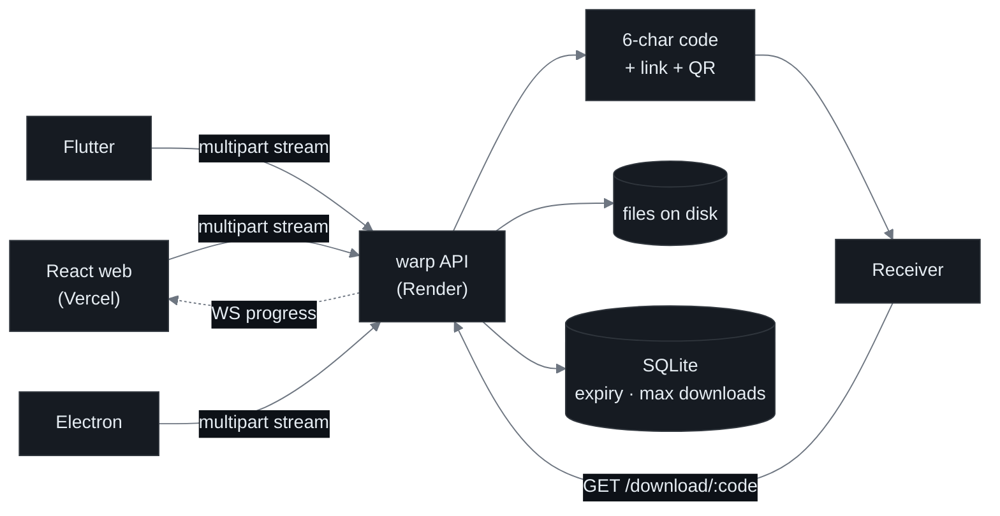

[→ open repo](https://github.com/AyushPandey510/SwiftShare) · [→ live app](https://swift-share-tau.vercel.app)

<b>LifeEngine AI</b>: talk to your future self

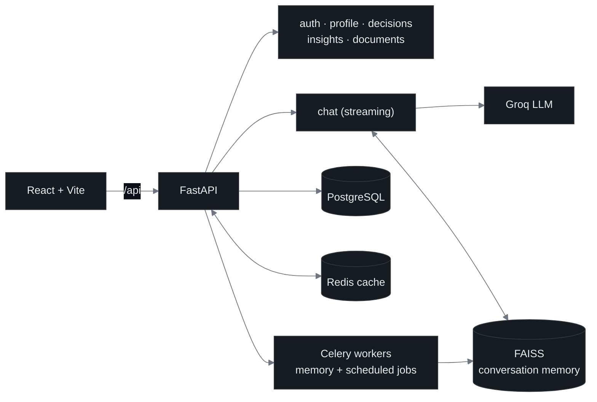

[→ open repo](https://github.com/AyushPandey510/LifeEngine)

<b>PDF-QA RAG</b>: answers only from the document, or says it doesn't know

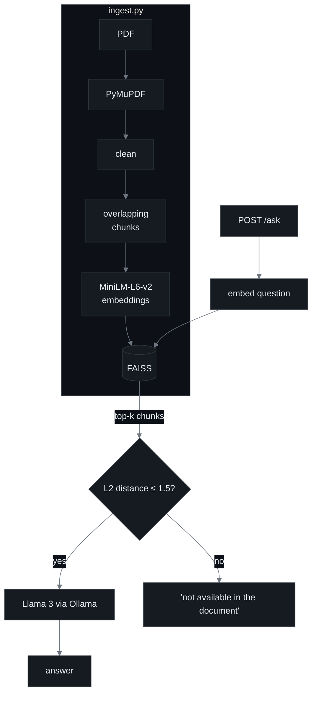

[→ open repo](https://github.com/AyushPandey510/PDF-QA-RAG-OLLAMA-llama3)

<b>XpenseCalc</b>: bank SMS in, spending insights out

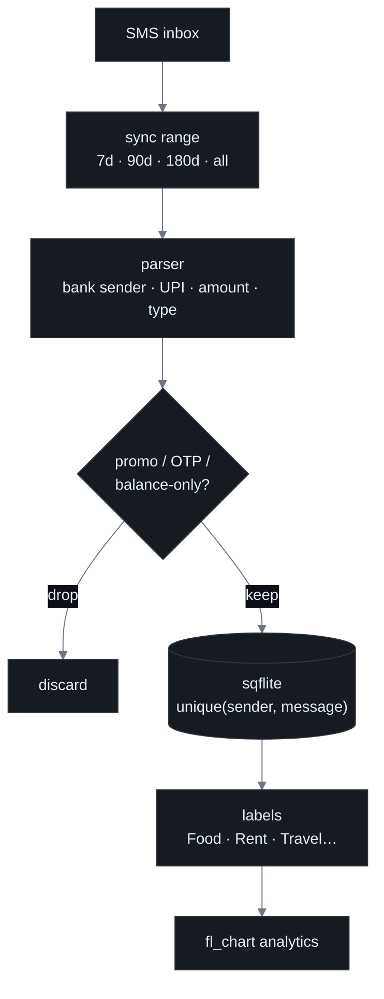

[→ open repo](https://github.com/AyushPandey510/expense_calc)

## Activity

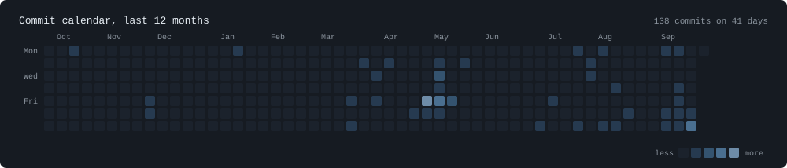

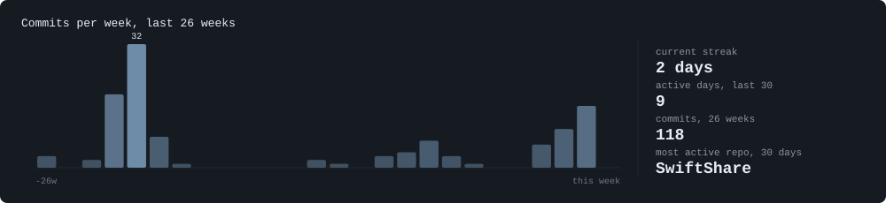

**Latest commits**

<!-- AUTO:COMMITS:START -->
| When | Repo | Commit |
|:--|:--|:--|
| 5h ago | **counter-drop** | [`353055b`](https://github.com/AyushPandey510/counter-drop/commit/353055ba0a46737a63e6c462cdba765832e2f717) chore: initial import with docs, design and backend slice |
| 12h ago | **SwiftShare** | [`cdba414`](https://github.com/AyushPandey510/SwiftShare/commit/cdba414333e263f970623cd4cdeba2a58f9211c3) feat: added a structured design file in web and dark mode fix |
| 12h ago | **SwiftShare** | [`e9f4307`](https://github.com/AyushPandey510/SwiftShare/commit/e9f43071d2d5425179ce680db3d0c3c947c1572f) feat: added a structured design file and dark mode loader fix |
| 12h ago | **SwiftShare** | [`4b6b17e`](https://github.com/AyushPandey510/SwiftShare/commit/4b6b17e7055c77d667a931e1d4e7e96e1cc9f042) fix: Mobile download bug |
| 1w ago | **gps-mock** | [`c1b7420`](https://github.com/AyushPandey510/gps-mock/commit/c1b7420e11786d2e3ce04d1b5d90388acd849067) fix: build issue in github workflow |
| 1w ago | **gps-mock** | [`162b130`](https://github.com/AyushPandey510/gps-mock/commit/162b13032db3b26841593807f0a910b838abfdf2) added privacy-policy screen and fixed minor issues |
| 1w ago | **gps-mock** | [`67e7e46`](https://github.com/AyushPandey510/gps-mock/commit/67e7e46967f4feaa5e4bd1760c5484c699bfc4b2) GPS MOCK Location Ready |
| 1w ago | **Space** | [`2de0291`](https://github.com/AyushPandey510/anonymous/commit/2de0291f28df2d22a574bf74c917f8a17f6e20f1) fix: theme based on system by-default and settings page |
| 1w ago | **Space** | [`9b277f4`](https://github.com/AyushPandey510/anonymous/commit/9b277f46f1ecf04cebb2700675bebbb7390d3944) fix: relpy message |
| 1w ago | **Space** | [`ee4cfed`](https://github.com/AyushPandey510/anonymous/commit/ee4cfed3c643c8b2fa598fb448d2407be6526f04) fix: Add privacy-safe location retention and secure auth storage |
<!-- AUTO:COMMITS:END -->

## Metrics

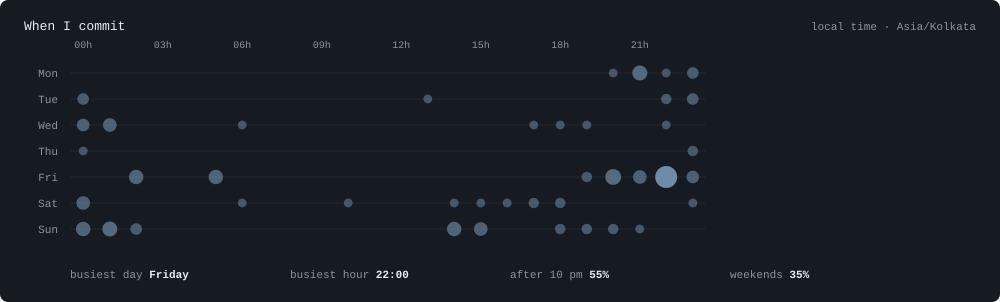

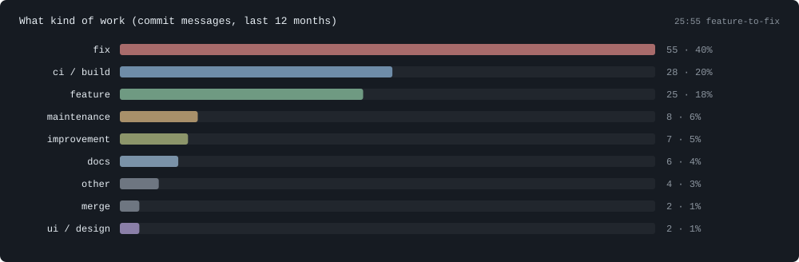

<!-- AUTO:PIE:START -->
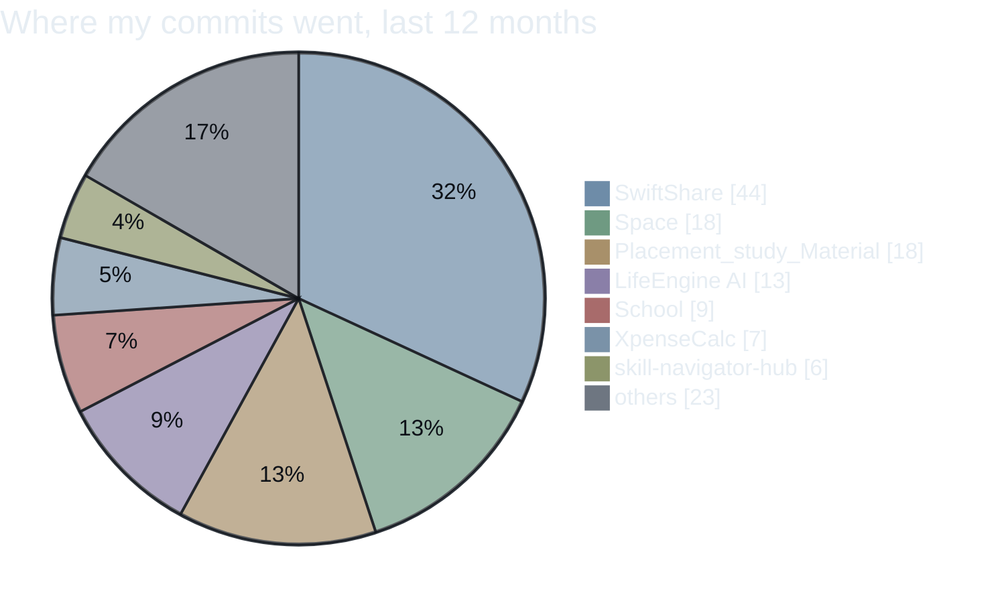
<!-- AUTO:PIE:END -->

## Project comparison

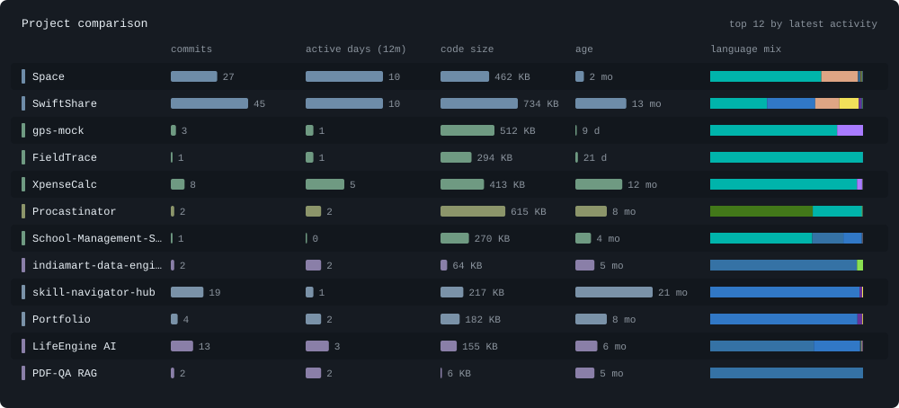

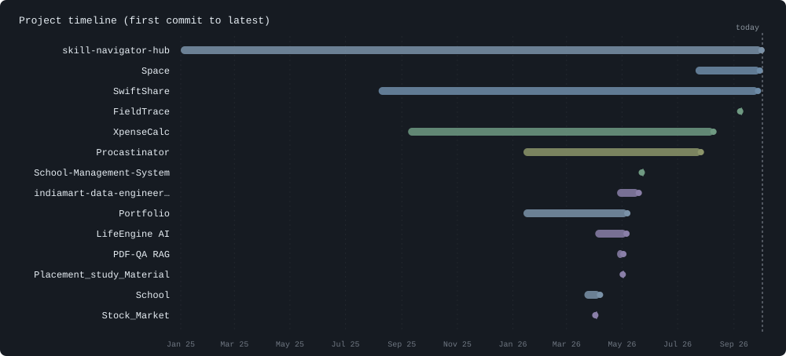

<b>Comparison table</b>

<!-- AUTO:COMPARE:START -->
| Project | Commits | Active days (12m) | First commit | Latest commit | Main language | Size |
|:--|--:|--:|:--|:--|:--|--:|
| [counter-drop](https://github.com/AyushPandey510/counter-drop) | 1 | 1 | Sep 2026 | 27 Sep 2026 | `Go` | 35 KB |
| [SwiftShare](https://github.com/AyushPandey510/SwiftShare) | 45 | 10 | Aug 2025 | 27 Sep 2026 | `Dart` | 734 KB |
| [gps-mock](https://github.com/AyushPandey510/gps-mock) | 3 | 1 | Sep 2026 | 20 Sep 2026 | `Dart` | 512 KB |
| [Space](https://github.com/AyushPandey510/anonymous) | 26 | 9 | Jul 2026 | 14 Sep 2026 | `Dart` | 462 KB |
| [FieldTrace](https://github.com/AyushPandey510/FieldTrace) | 1 | 1 | Sep 2026 | 07 Sep 2026 | `Dart` | 294 KB |
| [XpenseCalc](https://github.com/AyushPandey510/expense_calc) | 8 | 5 | Sep 2025 | 09 Aug 2026 | `Dart` | 413 KB |
| [Procastinator](https://github.com/AyushPandey510/Procastinator) | 2 | 2 | Jan 2026 | 26 Jul 2026 | `Makefile` | 615 KB |
| [School-Management-System](https://github.com/AyushPandey510/School-Management-System) | 1 | 0 | May 2026 | 22 May 2026 | `Dart` | 270 KB |
| [indiamart-data-engineering-pipeline](https://github.com/AyushPandey510/indiamart-data-engineering-pipeline) | 2 | 2 | Apr 2026 | 19 May 2026 | `Python` | 64 KB |
| [skill-navigator-hub](https://github.com/AyushPandey510/skill-navigator-hub) | 19 | 1 | Jan 2025 | 07 May 2026 | `TypeScript` | 217 KB |
| [Portfolio](https://github.com/AyushPandey510/Portfolio) | 4 | 2 | Jan 2026 | 06 May 2026 | `TypeScript` | 182 KB |
| [LifeEngine AI](https://github.com/AyushPandey510/LifeEngine) | 13 | 3 | Apr 2026 | 05 May 2026 | `Python` | 155 KB |
| [PDF-QA RAG](https://github.com/AyushPandey510/PDF-QA-RAG-OLLAMA-llama3) | 2 | 2 | Apr 2026 | 02 May 2026 | `Python` | 6 KB |
| [Placement_study_Material](https://github.com/AyushPandey510/Placement_study_Material) | 18 | 1 | Apr 2026 | 01 May 2026 | `Python` | 256.4 MB |
| [School](https://github.com/AyushPandey510/School) | 9 | 3 | Mar 2026 | 06 Apr 2026 | `JavaScript` | 83 KB |
| [Stock_Market](https://github.com/AyushPandey510/Stock_Market) | 1 | 1 | Apr 2026 | 01 Apr 2026 | `Python` | 33 KB |
| [Madhav-gpt](https://github.com/AyushPandey510/Madhav-gpt) | 5 | 1 | Mar 2026 | 24 Mar 2026 | `JavaScript` | 50 KB |
| [Algerian_Forest_](https://github.com/AyushPandey510/Algerian_Forest_) | 2 | 1 | Mar 2026 | 21 Mar 2026 | `Python` | 56.7 MB |
| [PhisGuard](https://github.com/AyushPandey510/Phis_Shield) | 3 | 2 | Nov 2025 | 29 Nov 2025 | `Python` | 555 KB |
| [RustCart API](https://github.com/AyushPandey510/Rust-Ecom-Api) | 5 | 1 | Jul 2025 | 13 Oct 2025 | `Rust` | 146 KB |
| [Zettabyte](https://github.com/AyushPandey510/Zettabyte) | 3 | 0 | Jul 2025 | 10 Jul 2025 | `TypeScript` | 221 KB |
<!-- AUTO:COMPARE:END -->

## Languages

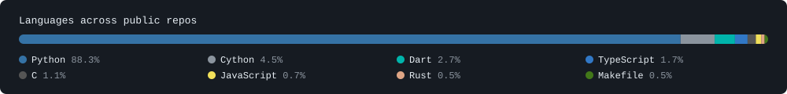

## All repositories

<!-- AUTO:ALL:START -->
| # | Project | Stack | Last commit | Status |
|:-:|:--|:--|:--|:-:|
| 01 | [**counter-drop**](https://github.com/AyushPandey510/counter-drop) No description yet. | `Go` | [chore: initial import with docs, design and b…](https://github.com/AyushPandey510/counter-drop/commit/353055ba0a46737a63e6c462cdba765832e2f717) 5h ago | active |
| 02 | [**SwiftShare**](https://github.com/AyushPandey510/SwiftShare) · [live ↗](https://swift-share-tau.vercel.app) Send a file, share a 6-char code. Rust/warp API, React web, Flutter +… | `Dart` | [feat: added a structured design file in web a…](https://github.com/AyushPandey510/SwiftShare/commit/cdba414333e263f970623cd4cdeba2a58f9211c3) 12h ago | active |
| 03 | [**gps-mock**](https://github.com/AyushPandey510/gps-mock) No description yet. | `Dart` | [fix: build issue in github workflow](https://github.com/AyushPandey510/gps-mock/commit/c1b7420e11786d2e3ce04d1b5d90388acd849067) 1w ago | active |
| 04 | [**Space**](https://github.com/AyushPandey510/anonymous) Anonymous, location-gated chat rooms. Rust/Axum geofence engine + Flu… | `Dart` | [fix: theme based on system by-default and set…](https://github.com/AyushPandey510/anonymous/commit/2de0291f28df2d22a574bf74c917f8a17f6e20f1) 1w ago | active |
| 05 | [**FieldTrace**](https://github.com/AyushPandey510/FieldTrace) No description yet. | `Dart` | [Quick Prototye Ready](https://github.com/AyushPandey510/FieldTrace/commit/ac9307ddcb5a7ebf881b348dcd3d3e91f26d7eb3) 2w ago | stable |
| 06 | [**XpenseCalc**](https://github.com/AyushPandey510/expense_calc) Reads bank SMS, parses UPI/debit/credit and charts your spending. Flu… | `Dart` | [update: updated the readme](https://github.com/AyushPandey510/expense_calc/commit/71977b8c428a4dff69cc7899b784c2970bbadb55) 1mo ago | stable |
| 07 | [**Procastinator**](https://github.com/AyushPandey510/Procastinator) No description yet. | `Makefile` | [fix:resolved bugs](https://github.com/AyushPandey510/Procastinator/commit/0421924b70d957f609741e70d8b2a3a3cd81157e) 2mo ago | stable |
| 08 | [**School-Management-System**](https://github.com/AyushPandey510/School-Management-System) No description yet. | `Dart` | [Initial Commit](https://github.com/AyushPandey510/School-Management-System/commit/92d82f99df1ae1ad35e0efe22c4d786efece91a3) 4mo ago | dormant |
| 09 | [**indiamart-data-engineering-pipeline**](https://github.com/AyushPandey510/indiamart-data-engineering-pipeline) No description yet. | `Python` | [Fix readme](https://github.com/AyushPandey510/indiamart-data-engineering-pipeline/commit/17d6c0d3d5eed62689e83c5bb74184e3f49142a1) 4mo ago | dormant |
| 10 | [**skill-navigator-hub**](https://github.com/AyushPandey510/skill-navigator-hub) · [live ↗](https://skill-navigator-hub.vercel.app) No description yet. | `TypeScript` | [Remove invalid runtime config](https://github.com/AyushPandey510/skill-navigator-hub/commit/097d2151d355e61fe3cfb19c8b5067c95dbce77d) 4mo ago | dormant |
| 11 | [**Portfolio**](https://github.com/AyushPandey510/Portfolio) · [live ↗](https://portfolio-ayushpandey.vercel.app) Personal site. React, Vite, TypeScript, shadcn/ui, Tailwind. | `TypeScript` | [Revise About section for clarity and detail](https://github.com/AyushPandey510/Portfolio/commit/b464c55146aad7d49f2510e911c08c024a232cc5) 4mo ago | dormant |
| 12 | [**LifeEngine AI**](https://github.com/AyushPandey510/LifeEngine) · [live ↗](https://life-engine-orcin.vercel.app) Chat with your future self. FastAPI, Postgres, Redis, Celery, FAISS m… | `Python` | [fix alembic multiple heads and shorten revisi…](https://github.com/AyushPandey510/LifeEngine/commit/e168fbe061ea47eaf8d6e24c66f0362c9558040d) 4mo ago | dormant |

<b>+ 9 more repos</b>

| # | Project | Stack | Last commit | Status |
|:-:|:--|:--|:--|:-:|
| 13 | [**PDF-QA RAG**](https://github.com/AyushPandey510/PDF-QA-RAG-OLLAMA-llama3) Ask a PDF anything, answered only from its text. MiniLM embeddings, F… | `Python` | [Update README.md](https://github.com/AyushPandey510/PDF-QA-RAG-OLLAMA-llama3/commit/d5f4e7b3fc9d632d290937b62525a2d5a9684145) 4mo ago | dormant |
| 14 | [**Placement_study_Material**](https://github.com/AyushPandey510/Placement_study_Material) · [live ↗](https://placement-study-material.vercel.app) No description yet. | `Python` | [fix: update Groq model name and fix indentati…](https://github.com/AyushPandey510/Placement_study_Material/commit/9b52d923f1723ccd0187e935c27824c452bd56e0) 4mo ago | dormant |
| 15 | [**School**](https://github.com/AyushPandey510/School) · [live ↗](https://school-two-sand.vercel.app) Edumentors Kids International School | `JavaScript` | [resolved the issue of learn more button in ad…](https://github.com/AyushPandey510/School/commit/0b84a1039bbf2d8a24c94997f969eb3077ee06ef) 5mo ago | dormant |
| 16 | [**Stock_Market**](https://github.com/AyushPandey510/Stock_Market) No description yet. | `Python` | [Initial commit](https://github.com/AyushPandey510/Stock_Market/commit/0a7983a0e12d6cb19eece95fe298a04ccccecc45) 5mo ago | dormant |
| 17 | [**Madhav-gpt**](https://github.com/AyushPandey510/Madhav-gpt) No description yet. | `JavaScript` | [Fixed the issues listed in BUGFIXES.md](https://github.com/AyushPandey510/Madhav-gpt/commit/fd7404c888822d8720abf808022173317488c6ef) 6mo ago | dormant |
| 18 | [**Algerian_Forest_**](https://github.com/AyushPandey510/Algerian_Forest_) No description yet. | `Python` | [score changes](https://github.com/AyushPandey510/Algerian_Forest_/commit/dbf4fcf392f81fc8afd53592a12cf00534146919) 6mo ago | dormant |
| 19 | [**PhisGuard**](https://github.com/AyushPandey510/Phis_Shield) Chrome extension + Flask API that scores URLs &amp; emails with scikit-le… | `Python` | [Final Changes before submission](https://github.com/AyushPandey510/Phis_Shield/commit/87ad0f3b2ca1f08e21174ff721982cc6e82106a7) 10mo ago | dormant |
| 20 | [**RustCart API**](https://github.com/AyushPandey510/Rust-Ecom-Api) E-commerce backend: Actix Web, Postgres, JWT/RBAC, Razorpay, Swagger. | `Rust` | [swagger sand other errors resolved](https://github.com/AyushPandey510/Rust-Ecom-Api/commit/dd9b7d4b5f083f06035e2572c2dcff9b28a27d20) 11mo ago | dormant |
| 21 | [**Zettabyte**](https://github.com/AyushPandey510/Zettabyte) Event manager with QR check-in. FastAPI + SQLAlchemy backend, React/V… | `TypeScript` | [frontend added](https://github.com/AyushPandey510/Zettabyte/commit/a74df207f319234978c4732449daa48e7ba02325) 1y ago | dormant |

<!-- AUTO:ALL:END -->

<!-- AUTO:UPDATED:START -->
Updated automatically · 27 Sep 2026, 21:26 UTC
<!-- AUTO:UPDATED:END -->

